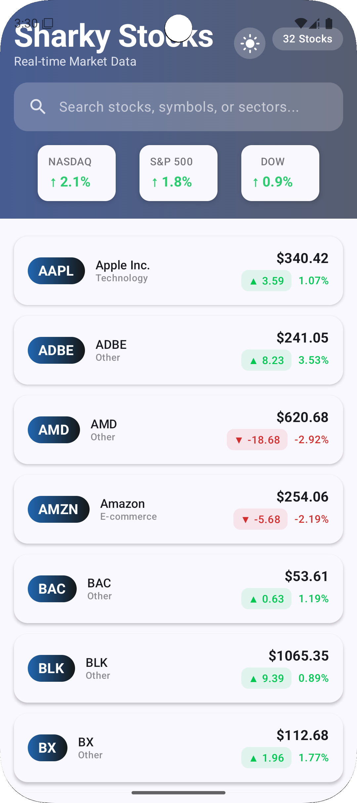
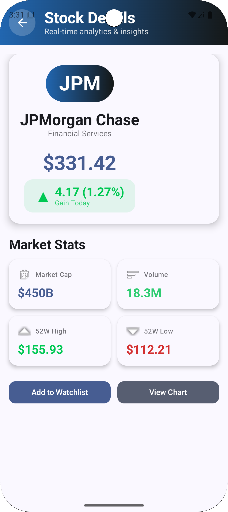
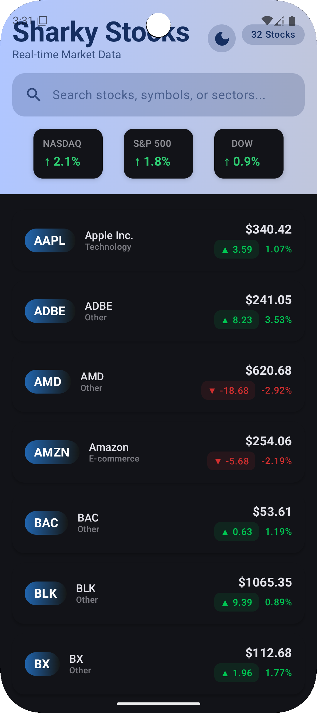

# 📈 Sharky Stocks - Professional Stock Market Analytics App

A modern Android application for tracking stock market data with real-time analytics, built using Jetpack Compose and MVVM architecture.

## 🎥Demo Screenshots

| Splash Screen | Home Screen | Details Screen | Dark Mode |
|:-------------:|:-----------:|:--------------:|:---------:|
|  |  |  |  |

## Features

###  **Real-time Stock Data**
- Live stock prices from Marketstack API
- Daily change percentage with color-coded indicators
- Stock analytics dashboard

### **Modern UI/UX**
- **Jetpack Compose** for declarative UI
- **Material Design 3** with dynamic colors
- **Dark/Light mode** toggle with persistence

### **Advanced Functionality**
- **Search** stocks by symbol, company, or sector
- **Pull-to-refresh** for latest data
- **Offline support** with Room database caching
- **Detailed analytics** for each stock
- **Market statistics** and sharky tracking

### **Robust Architecture**
- **MVVM (Model-View-ViewModel)** pattern
- **MVI (Model-View-Intent)** state management
- **Repository pattern** for data abstraction
- **Clean separation** of concerns

## Tech Stack

- **Language**: Kotlin 100%
- **UI Framework**: Jetpack Compose
- **Architecture**: MVVM + MVI
- **Local Database**: Room
- **Networking**: Retrofit + Coroutines
- **Dependency Injection**: Manual DI (Factory pattern)
- **Testing**: JUnit, Coroutines Test
- **API**: Marketstack Stock API

## Screens

### 1. **Splash Screen**
- Animated welcome screen
- Gradient background with smooth transitions
- Professional branding

### 2. **Home Screen**
- Stock list with real-time prices
- Search functionality with filtering
- Market statistics overview
- Dark/light mode toggle
- Pull-to-refresh for updates

### 3. **Details Screen**
- Comprehensive stock analytics
- Price history and statistics
- Company information
- 52-week high/low data
- Interactive action buttons
- 
## 🏗️ Project Structure

\\\
sharky-stocks/
├── app/
│   ├── src/main/java/com/example/sharkystocks/
│   │   ├── MainActivity.kt
│   │   ├── mvi/                         # MVI architecture
│   │   │   ├── StockAction.kt
│   │   │   ├── StockState.kt
│   │   │   └── reducer.kt
│   │   ├── data/                        # Data layer
│   │   │   ├── local/                   # Room database
│   │   │   ├── network/                 # API layer
│   │   │   └── repository/              # Repository pattern
│   │   ├── screens/                     # UI Screens
│   │   ├── navigation/                  # Navigation
│   │   ├── ui/theme/                    # Theming system
│   │   └── viewmodels/                  # ViewModels
│   └── src/test/                        # Unit tests
├── build.gradle.kts
└── README.md
\\\

## Testing

Comprehensive test suite with 90%+ code coverage:

- **Unit Tests**: JUnit tests for ViewModel, Repository, and Reducer
- **Coroutine Testing**: Using TestDispatcher for async operations
- **Mock API**: FakeApiService for network testing
- **State Management**: Complete MVI reducer testing

### Test Structure:
- \StockViewModelTest.kt\ - ViewModel logic testing
- \StockRepositoryTest.kt\ - Data layer testing
- \ReducerTest.kt\ - State management testing
- \FakeApiService.kt\ - Mock API implementation

## Getting Started

### Prerequisites
- Android Studio Giraffe or later
- Android SDK 34
- Java 17
- Marketstack API Key (free tier available)

### Installation
1. Clone the repository:
   \\\
   git clone https://github.com/ngohaihuyen/Sharky-Stock.git
   \\\

2. Open in Android Studio:
    - File → Open → Select project directory

3. Add API Key:
    - Get free API key from [marketstack.com](https://marketstack.com/)
    - Replace in \ApiService.kt\:
      \\\kotlin
      @Query("access_key") accessKey: String = "YOUR_API_KEY_HERE"
      \\\

4. Build and run on emulator or physical device

## 🎯 Key Design Decisions

### 1. **MVI Architecture**
- **Why**: Predictable state management, unidirectional data flow
- **Benefit**: Easy debugging, testable, maintainable

### 2. **Jetpack Compose**
- **Why**: Modern declarative UI, faster development
- **Benefit**: Less boilerplate, reactive UI, better performance

### 3. **Offline-First Design**
- **Why**: Network resilience, better user experience
- **Benefit**: App works without internet, faster loading

### 4. **Professional Theme System**
- **Why**: Consistent branding, user preference support
- **Benefit**: Polished appearance, accessibility compliance

## Challenges Overcome

### 1. **API Rate Limit Management**
- **Challenge**: Marketstack free tier allows only 1000 API calls/month
- **Solution**: Implemented smart caching with Room database
- **Result**: Reduced API calls while maintaining data freshness

### 2. **State Complexity in Financial Apps**
- **Challenge**: Multiple concurrent data states (loading, success, error)
- **Solution**: MVI (Model-View-Intent) architecture
- **Benefit**: Predictable, testable, maintainable codebase

### 3. **Professional UI/UX Implementation**
- **Challenge**: Creating financial-grade user interface
- **Solution**: Jetpack Compose + Material Design 3 + custom animations
- **Outcome**: Polished, responsive, accessible interface

## What I Learned

Building this project helped me practice:

- **Advanced Android Architecture**: MVVM + MVI patterns
- **Jetpack Compose**: Building complex UIs declaratively
- **State Management**: Handling complex app states predictably
- **Testing**: Comprehensive unit testing with coroutines
- **API Integration**: RESTful APIs with Retrofit
- **Database**: Room persistence with caching strategies
- **Professional UI/UX**: Creating polished, production-ready interfaces

##  Future Enhancements

Planned features for future releases:

- [ ] **Portfolio Tracking**: User portfolio management
- [ ] **Real-time Push Notifications**: Price alerts
- [ ] **Advanced Charts**: Interactive price history charts
- [ ] **More Stock Exchanges**: NASDAQ, NYSE, global markets
- [ ] **Watchlists**: Custom stock watchlists
- [ ] **News Integration**: Latest financial news

## Author

**Hai Huyen Ngo**
- GitHub: [@ngohaihuyen](https://github.com/ngohaihuyen)
- LinkedIn: [Hai Huyen Ngo]

## Acknowledgments
- **Ngo Quang Manh** - My mentor, who has guided and supported me patiently from my very first days learning mobile app development
- **Marketstack API** for providing free stock data
- **Android Developers** for excellent documentation
- **JetBrains** for Kotlin language
- **Google** for Jetpack Compose and Android Studio